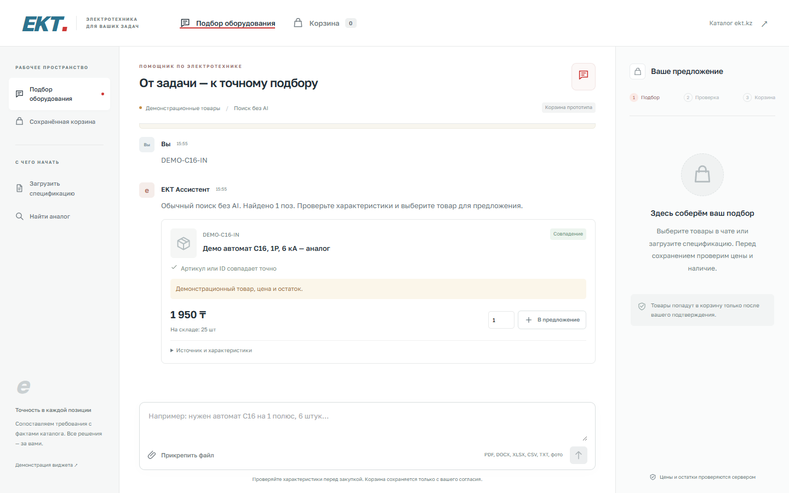
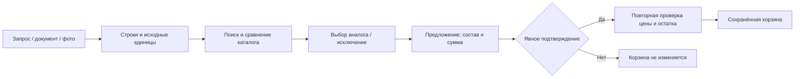

# EKT Assistant

**Из спецификации — в проверяемое предложение и сохранённую корзину.**

Ассистент для подбора электротехнических товаров: принимает запрос, документ или фотографию, сопоставляет позиции с каталогом, объясняет кандидатов на замену и сохраняет выбранный состав только после явного подтверждения.

Проект команды **BibaMansBaha** для HackAlem AI. Next.js · React · TypeScript · OpenAI Responses API · SQLite.



> **Статус:** локальный продукт проверен; внешняя HTTPS-публикация ещё не принята. Каталог `fixture` содержит синтетические цены и остатки. Корзина `prototype` не создаёт заказ на ekt.kz и не резервирует склад.
>
**[Открыть работающее демо → ekt-assistant.vercel.app](https://ekt-assistant.vercel.app)** · [Корзина](https://ekt-assistant.vercel.app/cart) · [Виджет](https://ekt-assistant.vercel.app/embed)

Vercel + Neon PostgreSQL + **GPT-5.5, reasoning low**. На публичном HTTPS проверены настоящий текст и vision, загрузка файлов, подтверждение и сохранение корзины. Демо использует явно помеченный синтетический каталог; это не реальные цены/остатки ekt.kz и не оформление заказа. [Полный отчёт и ограничения](docs/VERCEL_DEPLOYMENT_REPORT.md).

Для демонстрации введите `Найди DEMO-CABLE, нужно 2 упаковки` или загрузите CSV из примера ниже. Проверьте единицы и предложение перед подтверждением. Фото/сканы отправляются OpenAI; используйте только безопасные демоматериалы.

## Как проходит подбор



Модель извлекает намерение и читаемые надписи. Цены, остатки, итоговая сумма, проверка согласия и запись корзины контролируются серверным кодом.

## Запустить за несколько минут

Нужны **Node.js 24+**, npm и Git. Для браузерных E2E дополнительно требуется установленный Google Chrome.

```bash
git clone https://github.com/BAITC-Hacks/hack-53afffc3-bibamansbaha.git
cd hack-53afffc3-bibamansbaha
npm ci
```

Создать локальную конфигурацию, сохранив существующий файл с доступами:

**PowerShell**

```powershell
if (-not (Test-Path .env.local)) { Copy-Item .env.example .env.local }
```

**Linux / macOS**

```bash
if [ ! -f .env.local ]; then cp .env.example .env.local; fi
```

Для бесплатного знакомства оставить `CATALOG_MODE=fixture`, `OPENAI_API_KEY=` и `OPENAI_MODEL=`. Если используете существующий `.env.local`, сначала проверьте эти настройки: там могут быть включены платные вызовы.

```bash
npm run dev
```

Открыть [ассистента](http://127.0.0.1:3000), [корзину](http://127.0.0.1:3000/cart) или [пример виджета](http://127.0.0.1:3000/embed).

В этом режиме работают обычный поиск, текстовые спецификации, сравнение и подтверждение корзины. Фото и сканы требуют отдельно подключённой модели; отключённый AI не выдаётся за работающий.

## Демо на 2–3 минуты

```bash
node scripts/create-demo-files.mjs
```

1. Загрузить `.tmp/demo-files/fixture-specification.csv`.
2. Для отсутствующего `DEMO-C16-OUT` выбрать предложенный `DEMO-C16-IN`; просмотреть совпадения и отличия.
3. Проверить кабель, количество и единицы. Лишнюю строку можно явно исключить.
4. Подготовить предложение. До подтверждения корзина не меняется.
5. Нажать подтверждение, открыть `/cart`, обновить страницу — состав сохранится.

Дополнительная проба: `fixture-unit-review.csv` содержит упаковки. Ассистент сохраняет исходную единицу и требует проверки; упаковки не превращаются в метры автоматически. Подробный [сценарий демонстрации](docs/demo.md).

## Возможности и ограничения

| Возможность | Что реализовано |
| --- | --- |
| Сведения о товаре | Артикул, характеристики, цена, остаток, источник и время получения; неизвестные значения не подставляются |
| Аналоги | Кандидаты с сопоставлением критических параметров и объяснением отличий; проверены на fixture |
| Условия покупки | Ответы со ссылками на официальные источники; противоречия условий явно обозначаются |
| Документы | CSV/TXT, XLSX, DOCX, PDF с текстом; формулы не исполняются |
| Фото и сканы | JPEG/PNG/WebP и PDF-сканы через внешний vision; извлечённое предлагается для проверки |
| Проверка строк | Редактирование, ручной выбор, исключение, сохранение исходных единиц и состояния после reload |
| Предложение | Состав, сумма корзины до/после, изменение стоимости и переоценка уже добавленных товаров |
| Подтверждение | Связано с конкретной версией предложения; изменение фактов требует нового просмотра |
| Корзина | Серверное хранение, дробные количества, явное сохранение правок, защита от повторного добавления |
| Интерфейс | Desktop/mobile и same-origin iframe; интеграция с CMS магазина не подтверждена |

**Лимиты файлов:** 8 МБ, до 100 позиций, до 20 страниц PDF; не более 3 страниц скана для vision. Старые `.xls`/`.doc` нужно пересохранить. Архивные бомбы, макросы и XML entities отклоняются. Асинхронная обработка ограничена 45 секундами; синхронный Office-парсинг не вынесен в отдельный worker.

**Серверные правила корзины:** предложение действует 10 минут; перед confirm перепроверяются цена, остаток и техническая идентичность. Неизвестные обязательные данные блокируют добавление. Чужая сессия, устаревшая версия или повторный запрос не могут изменить корзину неправомерно. Реальные заказы и оплаты отсутствуют.

## Конфигурация

Все секреты задаются только серверному процессу через `.env.local` или защищённое окружение. Не используйте `NEXT_PUBLIC_` для ключей. После изменения env перезапустите приложение.

| Переменная | Назначение |
| --- | --- |
| `CATALOG_MODE` | `fixture` для синтетического демо; `live` для разрешённого API ekt.kz |
| `EKT_API_BASE_URL` | Базовый адрес каталога; пример — `https://ekt.kz` |
| `EKT_API_USERNAME`, `EKT_API_PASSWORD` | Серверные реквизиты live-каталога |
| `CATALOG_MAX_PAGES` | По умолчанию 2 страницы / 40 товаров: поиск по частичному каталогу |
| `CATALOG_OPERATION_TIMEOUT_MS` | Общий бюджет отдельной операции каталога; пример 6000 мс |
| `OPENAI_API_KEY`, `OPENAI_MODEL` | Серверный ключ и модель; без них используется обычный поиск |
| `DATABASE_PATH` | SQLite с сессиями, предложениями и корзинами; локально `.data/ekt.sqlite` |
| `APP_ORIGIN` | Точный origin браузера, включая схему и порт |
| `MODEL_BUDGET_PATH` | Абсолютный путь постоянного ledger одноразовой проверки AI; каталог должен существовать |
| `MODEL_BUDGET_MAX_CALLS`, `MODEL_BUDGET_MAX_USD` | Текущая acceptance-защита: максимум 6 вызовов / $0.25; можно уменьшить |

`fixture`, `live` и `prototype` обозначаются раздельно. Автоматической подмены недоступного live-каталога синтетическими данными нет. `snapshot` отклоняется, пока не подключён проверенный снимок.

Для GPT-5.5 используется Responses API с `reasoning.effort=low`. Бюджет резервируется до вызова по верхней границе входа и выхода; reasoning уже включён в output tokens. Acceptance (`MODEL_BUDGET_MODE=acceptance`) ограничен 6 вызовами/$0.25, demo (`demo`) — отдельными 100 вызовами/$1 без автоматического сброса. На Vercel оба журнала находятся в Neon; без `DATABASE_URL` файлового fallback нет. Локально используются отдельные абсолютные `MODEL_BUDGET_PATH`/`DEMO_BUDGET_PATH`. Не удаляйте журналы для возобновления лимитов.

Vercel хранит `OPENAI_API_KEY`, `DATABASE_URL`, `EKT_API_USERNAME` и `EKT_API_PASSWORD` в server-side Environment Variables. Ключей нет в README, Git или `NEXT_PUBLIC_*`. Миграция чистой базы: `npm run db:migrate` при заданном `DATABASE_URL`. Она не импортирует локальные пользовательские данные.

## Проверки

```bash
npm run typecheck
npm run lint
npm test
npm run build
npm run test:e2e
```

После миграции прошли **98 локальных unit/integration**, **24 browser E2E**, отдельный regression на настоящей Neon, typecheck, lint и production build. На публичном URL отдельно проверены файлы, контекст, настоящий vision, корзина, две сессии и мобильный интерфейс. Локальный E2E запускает dev-server на порту 3001 с отключённой моделью; результаты опубликованной версии приведены отдельно в отчёте.

Текстовые и vision-ответы в большинстве тестов подменены на уровне провайдера. Платные smoke-проверки выполняются отдельно, в согласованном бюджете; они не входят в обычный запуск тестов. [Подробная матрица и блокеры](docs/DEPLOYMENT_ACCEPTANCE.md).

## Production и хранение

```bash
npm ci
npm run build
npm start
```

`npm start` запускает `next start --hostname 127.0.0.1`. Нужны HTTPS reverse proxy в подходящем сетевом пространстве и точный `APP_ORIGIN`. Production-cookie имеет флаг Secure; обычный локальный HTTP не доказывает рабочую production-сессию.

На Vercel зависимости и сборка создаются заново: Windows `node_modules` и `.next` не переносятся. Постоянное состояние находится в PostgreSQL Neon. Сессия сохраняет корзину, позиции, сообщения, предложения и квитанции подтверждения одним aggregate; `SELECT FOR UPDATE` защищает параллельные invocations. Существующий CartService работает с изолированной SQLite `:memory:` в пределах одного запроса; эта рабочая копия не является постоянным хранилищем. Файловая SQLite остаётся только локальным адаптером.

Публичный URL, версия, проверка повторного deployment, реальные ответы модели и оставшиеся ограничения фиксируются в [отчёте Vercel](docs/VERCEL_DEPLOYMENT_REPORT.md). Загружаются небольшие файлы до 4 МБ; raw uploads обрабатываются в памяти. Бизнес-состояние и бюджеты не зависят от файловой системы и срока жизни Vercel Function.

## Архитектура

| Путь | Ответственность |
| --- | --- |
| `src/server/catalog.ts` | Read-only API, нормализация, ограниченный поиск, консервативное сравнение кандидатов |
| `src/server/attachments.ts` | Валидация файлов, извлечение строк и исходных единиц |
| `src/server/model.ts` | OpenAI Responses и structured outputs; без полномочий изменять корзину |
| `src/server/model-budget.ts` | Постоянный учёт попыток, резервирование стоимости и usage без содержимого запросов |
| `src/server/cart.ts` | SQLite, владение сессией, preview, fresh-проверка, транзакция и идемпотентность |
| `src/app/api/[action]/route.ts`, `src/server/http.ts` | Контракты HTTP, CSRF/origin и ограничения запросов |
| `src/components` | Чат, спецификация, карточки, подтверждение, корзина и виджет |

## Приватность и честные границы

Исходные загрузки обрабатываются в памяти. Диалог, извлечённые строки, предложения и корзина сохраняются в SQLite. Сессия действует 24 часа; очистка истёкших записей выполняется при создании следующей сессии.

Не загружайте платёжные и личные документы. Распознаваемые платёжные реквизиты блокируются до записи и текстового вызова модели; старые сообщения маскируются при чтении. **Это не универсальная DLP:** изображение может уйти внешнему AI до распознавания его содержимого. Очистка прежних WAL, backup и provider-журналов не заявляется.

Для live-интеграции остаются неподтверждённые единицы, семантика кратности, сертификаты и часть технических характеристик. Неизвестные данные не угадываются. Нативный API корзины ekt.kz не предоставлен; prototype не является заказом или резервированием склада.

## Документация

- [Production-развёртывание и текущая точка продолжения](docs/PRODUCTION_DEPLOYMENT_REPORT.md)
- [Приёмка: результаты, среда и непроведённые проверки](docs/DEPLOYMENT_ACCEPTANCE.md)
- [Отчёт исправлений](docs/REPAIR_REPORT.md) · [исходный аудит](docs/FINAL_AUDIT.md)
- [Демо-сценарий](docs/demo.md) · [API и вопросы к партнёру](docs/api-contract.md)
- [Источники условий покупки](docs/purchase-terms.md) · [реестр skills/MCP](docs/skills-usage.md)

При разработке используются явное добавление файлов, `git diff --cached --check` и `node scripts/check-secrets.mjs`. После push SHA сверяется с `git ls-remote origin refs/heads/main`. Секреты, приватные документы, SQLite и загрузки не публикуются; история Git не переписывается.
